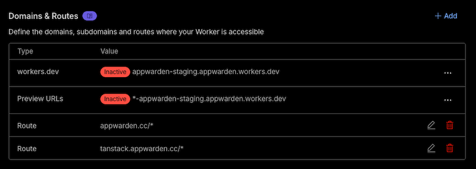

# appwarden/build-cloudflare-action


[](https://opensource.org/licenses/MIT)

Easy-to-use GitHub Action to build Appwarden for deployment to your Cloudflare domain.

> Read the docs to [get started](https://appwarden.io/docs/guides/cloudflare-integration)

## Features

- 🚀 **Automated Middleware Generation**: Generates Cloudflare middleware populated with your Appwarden domain configuration compatible with any website
- 🛡️ **Security Configuration**: Configures Content Security Policy (CSP) and lock page settings
- 🧪 **Debug Mode**: Built-in debug mode for troubleshooting deployments
- 📦 **Zero Configuration**: Works out of the box with minimal setup required

## Why Use This Action?

This GitHub Action is the **official and recommended way** to install [Appwarden](https://appwarden.io/docs) on any website deployed on Cloudflare.

### Automatic Updates

The action automatically deploys the most up-to-date version of Appwarden without requiring any additional configuration. Your middleware stays current with the latest security features and improvements.

### Configuration Management

Your middleware configuration is automatically applied from your [domain configuration file](https://appwarden.io/docs/guides/domain-configuration-management). Simply define your settings once, and the action handles the rest.

### Full CSP Support

This action fully supports Appwarden's nonce-based Content Security Policy (CSP) functionality, enabling robust protection against browser-based attacks while maintaining compatibility with your application.

### How It Works

The action builds a single Cloudflare Worker script that runs on every request to the hostnames listed in the `middleware` section of your domain configuration files.

For example, given this domain configuration:

```yaml
hostname: appwarden.cc
version: 1
websites:
  middleware:
    - url: appwarden.cc
      options:
        lock-page-slug: /maintenance
        csp-mode: report-only
        csp-directives:
          script-src:
            - "self"
            - "{{nonce}}"
    - url: tanstack.appwarden.cc
      options:
        lock-page-slug: /maintenance
        csp-mode: enforced
        csp-directives:
          img-src:
            - "self"
```

The deployed Cloudflare Worker will include a route for each configured hostname:



## Inputs

| Input                   | Description           | Required | Default |
| ----------------------- | --------------------- | -------- | ------- |
| `cloudflare-account-id` | Cloudflare account id | ✅       | -       |
| `appwarden-api-token`   | Appwarden API token   | ✅       | -       |
| `debug`                 | Enable debug mode     | ❌       | `false` |

## Outputs

| Output              | Description                                                      |
| ------------------- | ---------------------------------------------------------------- |
| `middlewareVersion` | The version of @appwarden/middleware that was deployed           |
| `hostnames`         | Comma-separated list of hostnames the middleware was deployed to |

## Installation

<!-- # todo add link to workflow here -->

> [Read the docs](https://appwarden.io/docs/guides/cloudflare-integration) to learn more

## Development

### Prerequisites

- Node.js 22+
- npm

### Setup

```bash
# Clone the repository
git clone https://github.com/appwarden/build-cloudflare-action.git
cd build-cloudflare-action

# Install dependencies
npm install
```

### Testing

This project uses Vitest for testing with comprehensive unit tests:

```bash
# Run tests in watch mode
npm test

# Run tests once
npm run test:run

# Run tests with coverage
npm run test:coverage
```

The test suite includes:

- **Unit tests** for the main action logic
- **Template tests** for Wrangler configuration generation
- **Validation tests** for input schemas and domain validation
- **Mock tests** for external API calls and file system operations

### Code Quality

```bash
# Format code
npm run format

# Check formatting
npm run check:prettier

# Type checking
npm run check:types

# Build the action
npm run build
```

## License

MIT
